class: center, middle, inverse

# Motivation

--

# "If income gaps are not reduced, the next crisis will happen as surely as autumn follows summer"

--

.right[<i>An interview with Michael Kumhof by Mikael Feldbaum, https://www.eurozine.com, 2012</i>]
---
class: center, bottom, inverse
background-image: url(images/MARCHA.jpg)
background-size: cover

### "If income gaps are not reduced, the next crisis will happen as surely as autumn follows summer"

---
class: inverse, center, middle

# General Research problem

--
## Income inequality could have a significant effect on social cohesion and instability, spreading its influence like a *disease*

--

(Brunori, Ferreira, & Peragine, 2013; R. Kanbur, 2005; S. M. R. Kanbur & Venables, 2005; Milanovic, 2016; Ocampo, 2004)

--

## The issue of inequality has taken a secondary place in the design of economic policy compared to efficiency measures such as Economic Growth

--

 <!-- + Among **consequences**:
  + **Unemployment**, **increasing fiscal expenses**, **indebtedness** and **political instability** (Berg & Ostry,2011). 
  + **crime rates**, **teenage pregnancy**, **obesity**, and **fewer opportunities** to invest in health and education(Atkinson, 2015). 
  + Inequality of opportunities hampers **social and economic mobility**, **trust** and **social cohesion**.
  + Slow down **economic growth** by making it less inclusive and sustainable --> 
???
For instance, reflected in:
- justifications to delay reforms
- data availability

---
class: inverse, center, middle

# Essay 1:

--

# Natural Resources: Curse or Blessing?    Evidence on the Spatial Dimension of Income Inequality at the County Level in Chile

---

# Research so far

 <!-- + **Reporting a phenomenon of increasing inequality** (Berg & Ostry, 2017; Ostry, Berg, & Tsangarides, 2014; Cingano, 2014; OECD, 2014). --> 

+ **Causes of income inequality** include **levels of income at initial stages** of economic development (Kuznets, 1955), **Globalization** (Milanovic, 2016), **Skill-biased technological change** (Tinbergen, 1975), investment in **human capital** (Murphy & Topel, 2016), **Institutions**, **redistributive policy** and **country-specific characteristics** (Acemoglu, 1995, 2002; Acemoglu et al., 2001a, 2001c)

Natural Resources: Curse or Blessing? 
&emsp;&emsp;&emsp;&emsp;&emsp;&emsp;&emsp;&emsp;&emsp;&emsp;&emsp;&emsp;&emsp;
&emsp;&emsp;&emsp;&emsp;&emsp;&emsp;&emsp;&emsp;&emsp;&emsp;&emsp;&emsp;&emsp;

 

### The endowment of natural resources can influence inequality by:
+ Determining its **initial levels** (Engerman & Sokoloff, 1994, 1997; Engerman, Sokoloff, Urquiola, & Acemoglu, 2002), 
+ Shaping the evolution of **institutions** (Acemoglu, 2002), 
+ Dumbing the **educational system** and moulding the **structure of economic activity** (Leamer, Maul, Rodriguez, & Schott, 1999)
+ **Rent-seeking**, **delays in manufacturing and technology adoption** and **lower incentives for investment in physical and human capital** (Gylfason & Zoega, 2003).
+ Impact on economic growth (**“Natural Resource Curse Hypothesis”**) 
+ Effect on social cohesion and instability, spreading its influence like a **disease**

---
# Research so far

--

### Evidence for the Chilean economy has documented
+ High and persistent levels of income inequality
+ Significant spatial dimension (Aroca & Bosch, 2000; Paredes, Iturra, & Lufin, 2016)

--

### About the relevance of the spatial dimension
+ **Decomposing general indicators of inequality**. Evidence from countries including the US (Doran & Jordan, 2016), China (Akita, 2003; Gustafsson & Shi, 2002; Ye, Ma,Ye, Chen, & Xie, 2017; Yue, Zhang, Ye, Cheng, & Leipnik, 2014), Japan (Ohtake, 2008), South Africa (Leibbrandt, Finn, & Woolard, 2012) and Chile (Paredes et al., 2016).

--

+ Using **spatial methods** to analyse the nature of the spatial effects:
  + **Spatial heterogeneity** (different relationships in distinct locations)
  + **Spatial dependence** (cross-sectional interactions such as spillover
effects among units from distinct locations)

Natural Resources: Curse or Blessing? 
&emsp;&emsp;&emsp;&emsp;&emsp;&emsp;&emsp;&emsp;&emsp;&emsp;&emsp;&emsp;&emsp;
&emsp;&emsp;&emsp;&emsp;&emsp;&emsp;&emsp;&emsp;&emsp;&emsp;&emsp;&emsp;&emsp;

 

---
# Research Questions

> How does the natural resource endowment influence the paths and structure of income inequality in natural resource-rich countries?

&NewLine;
 
 

--
> Can the endowment of natural resources help to explain the persitently high levels of income inequality? 

&NewLine;
 
 

--
> What type of process describes the spatial dimension shown by income inequality?

Natural Resources: Curse or Blessing? 
&emsp;&emsp;&emsp;&emsp;&emsp;&emsp;&emsp;&emsp;&emsp;&emsp;&emsp;&emsp;&emsp;
&emsp;&emsp;&emsp;&emsp;&emsp;&emsp;&emsp;&emsp;&emsp;&emsp;&emsp;&emsp;&emsp;

 

---

# Research Hypoteses

**The Role of Natural Resources**

> *H1:* A higher degree of dependence on natural resources is associated with higher levels of income inequality.

 <!-- --
 
.center[**Why?**] --> 

--
 
 

**Nature and Relevance of the spatial dimension**

> *H2:* Income inequality shows a significant process of spatial dependence, that is, a process of interaction among units from distinct locations

Natural Resources: Curse or Blessing? 
&emsp;&emsp;&emsp;&emsp;&emsp;&emsp;&emsp;&emsp;&emsp;&emsp;&emsp;&emsp;&emsp;
&emsp;&emsp;&emsp;&emsp;&emsp;&emsp;&emsp;&emsp;&emsp;&emsp;&emsp;&emsp;&emsp;

 

---

# Data and Variables

+ Merging of the following datasets: 
  + Six waves of CASEN Survey for household data (years 2006-2009-2011-2013-2015-2017)  
  + SINIM for information about municipalities
  + INE for population data
  + SII for data on employment and number of firms

--

+ In total 1944 obsevations (324 municipalities in 6 years)

--

.pull-left[
### Dependent Variable

**Gini coefficient** of outonomous income (the sum of labour income and non-labour income such as rents, interests and pensions) for each county.
]

--

.pull-right[
### Independent Variable

**Measure of natural resource dependence**: Employment in the primary sector (mining, fishing, forestry and agriculture) as a percentage of the total employment in each county
]

Natural Resources: Curse or Blessing? 
&emsp;&emsp;&emsp;&emsp;&emsp;&emsp;&emsp;&emsp;&emsp;&emsp;&emsp;&emsp;&emsp;
&emsp;&emsp;&emsp;&emsp;&emsp;&emsp;&emsp;&emsp;&emsp;&emsp;&emsp;&emsp;&emsp;

 

---
name: gini-nrd-maps 

## Gini and NRD: Spatial distribution ([average 2006-17](#sa))

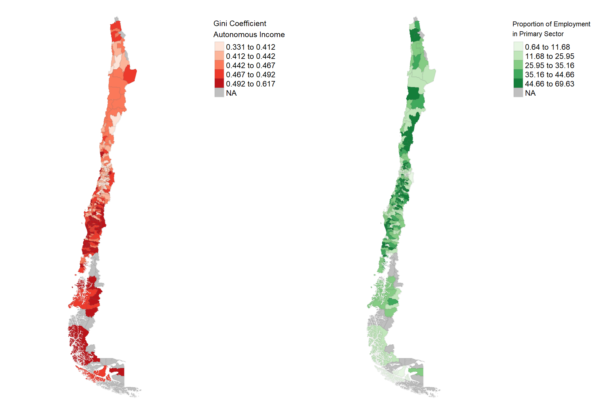

Natural Resources: Curse or Blessing? 
&emsp;&emsp;&emsp;&emsp;&emsp;&emsp;&emsp;&emsp;&emsp;&emsp;&emsp;&emsp;&emsp;
&emsp;&emsp;&emsp;&emsp;&emsp;&emsp;&emsp;&emsp;&emsp;&emsp;&emsp;&emsp;&emsp;

 
---
name: sa

# Methods: "Spatial Approach"

--

#### What do we mean by "spatial approach"?

+ Mapping the spatial distribution of the [variable](#gini-nrd-maps)

--

+ Defining the relevant neighborhood for each county (matrix **W**).

--

+ Testing the significance of the spatial patterns (Spatial Autocorrelation)

--

+ Checking whether the clustering pattern in inequality is the result of a process of spatial dependence in the variable itself or it can be explained by other variables:

--

  + Run an OLS regression of Gini against NRD and controls

--

  + Test for spatial autocorrelation in the OLS residuals

--

+ Using spatial models to find the spatial structure that best fits the clustering process of income inequality after controlling for other variables

--

  + Spatial cross-sectional models
  + Spatial static panel models

Natural Resources: Curse or Blessing? 
&emsp;&emsp;&emsp;&emsp;&emsp;&emsp;&emsp;&emsp;&emsp;&emsp;&emsp;&emsp;&emsp;
&emsp;&emsp;&emsp;&emsp;&emsp;&emsp;&emsp;&emsp;&emsp;&emsp;&emsp;&emsp;&emsp;

 

???
The interaction is throughout space, not time
---
class: inverse, center, middle

# Results

---
## Testing spatial correlation (Moran's I)

.pull-left[
+ $H_0$: Spatial randomness (I = 0)  
+ $H_1$: Spatial autocorrelation:
    + Positive (I > 0)
    + Netagive (I < 0)

#### Positive Spatial Autocorrelation: 

> Counties with similar levels of inequality tend to be close each other

]

--
 <!--  --> 
.pull-right[

]

Natural Resources: Curse or Blessing? 
&emsp;&emsp;&emsp;&emsp;&emsp;&emsp;&emsp;&emsp;&emsp;&emsp;&emsp;&emsp;&emsp;
&emsp;&emsp;&emsp;&emsp;&emsp;&emsp;&emsp;&emsp;&emsp;&emsp;&emsp;&emsp;&emsp;

 

---

## Analysis of OLS residuals 

+ We run the model:

\begin{align}
&gini_i = \beta_0 + \beta_1 pss\_casen + \beta_2 lnincome + \beta_3 poverty  + \beta_4 unemployment +\\
&\qquad \quad \beta_5 labour\_force + \beta_6 education + \beta_7 lndensity + \beta_8 rural + \\ 
&\qquad \quad \beta_9 lnmuni\_expenditure + \nonumber \beta_{10} north + \beta_{11} south \nonumber
\end{align}

--

.pull-left[
+ We get the OLS residuals
+ We test for spatial autocorrelation in OLS residuals
]

--

.pull-right[
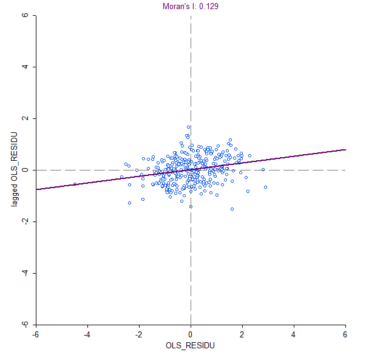
]

Natural Resources: Curse or Blessing? 
&emsp;&emsp;&emsp;&emsp;&emsp;&emsp;&emsp;&emsp;&emsp;&emsp;&emsp;&emsp;&emsp;
&emsp;&emsp;&emsp;&emsp;&emsp;&emsp;&emsp;&emsp;&emsp;&emsp;&emsp;&emsp;&emsp;

 
---
## Spatial Model Specification (Cross-Sectional)

The model could be expressed as:

\begin{equation}
y=\lambda Wy+X\beta+WX\gamma+u
\end{equation}

where

\begin{equation}
u=\rho Wu+\varepsilon
\end{equation}

+ $W$ is our weight matrix that works as a NxN spatial lag operator (**Spatial Lag**: Weighted sum of the values observed at neighboring locations) 

+ Thus, the parameter: 
  + $\lambda$ capture the influence of the spatial lag for the dependent variable, $Wy$,
  + $\gamma$ capture the influence of the spatial lag for the explanatory variables, $WX$, 
  + $\rho$ capture the influence of the spatial lag for the errors, $Wu$,
  + $\epsilon$ is a vector of idiosyncratic errors.

Natural Resources: Curse or Blessing? 
&emsp;&emsp;&emsp;&emsp;&emsp;&emsp;&emsp;&emsp;&emsp;&emsp;&emsp;&emsp;&emsp;
&emsp;&emsp;&emsp;&emsp;&emsp;&emsp;&emsp;&emsp;&emsp;&emsp;&emsp;&emsp;&emsp;

---
class: center

### Cross-sectional Model Comparison (six-year average data)

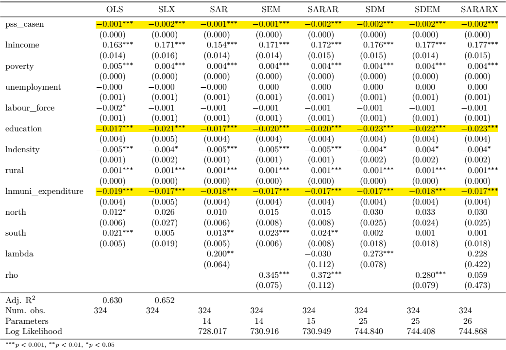

Natural Resources: Curse or Blessing? 
&emsp;&emsp;&emsp;&emsp;&emsp;&emsp;&emsp;&emsp;&emsp;&emsp;&emsp;&emsp;&emsp;
&emsp;&emsp;&emsp;&emsp;&emsp;&emsp;&emsp;&emsp;&emsp;&emsp;&emsp;&emsp;&emsp;

---
class: center

### Panel Data Regressions (non-spatial)

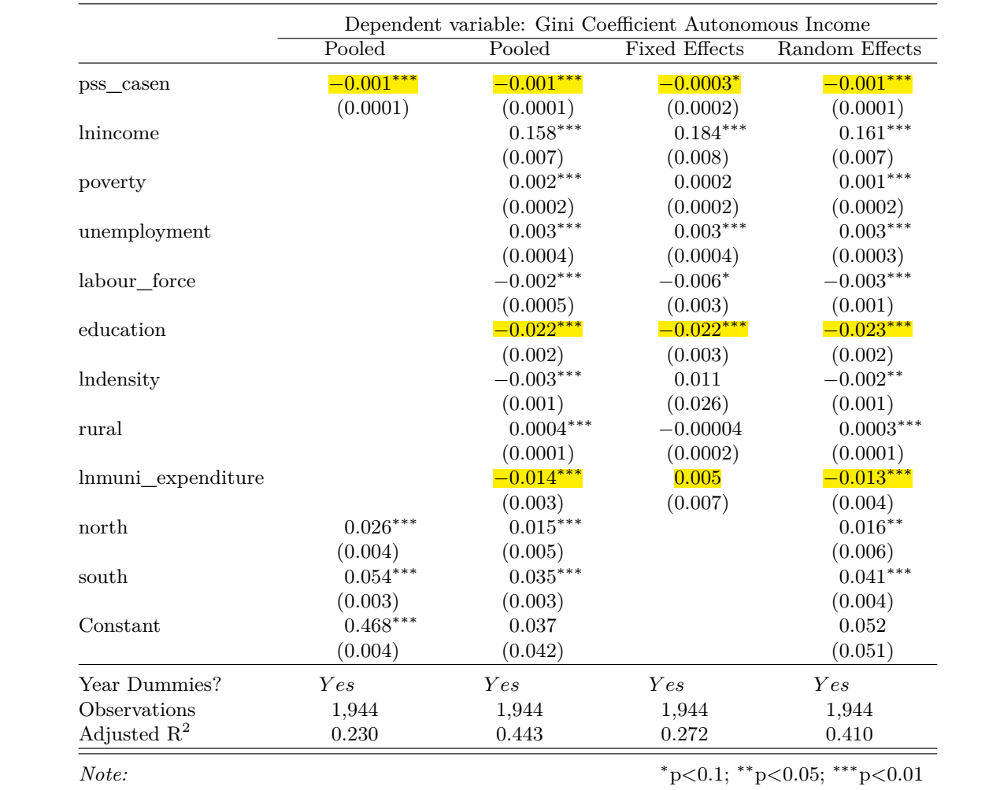

Natural Resources: Curse or Blessing? 
&emsp;&emsp;&emsp;&emsp;&emsp;&emsp;&emsp;&emsp;&emsp;&emsp;&emsp;&emsp;&emsp;
&emsp;&emsp;&emsp;&emsp;&emsp;&emsp;&emsp;&emsp;&emsp;&emsp;&emsp;&emsp;&emsp;

---
class: center
### Panel Data Regressions (Spatial)

.pull-left[
#### ML Spatial SAR Models
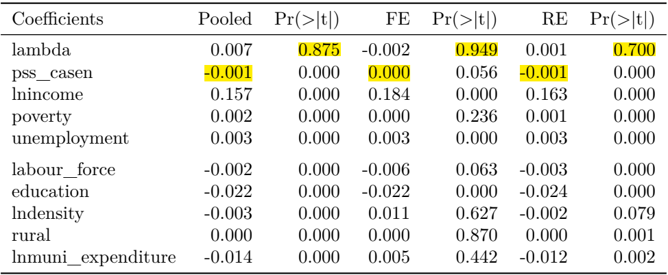
]

--

.pull-right[
#### ML Spatial SEM Models
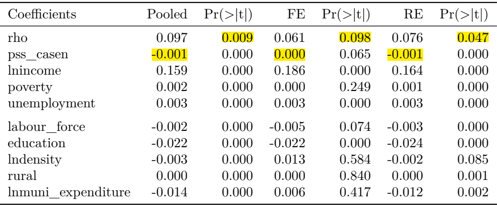
]

--

#### GM Spatial Models
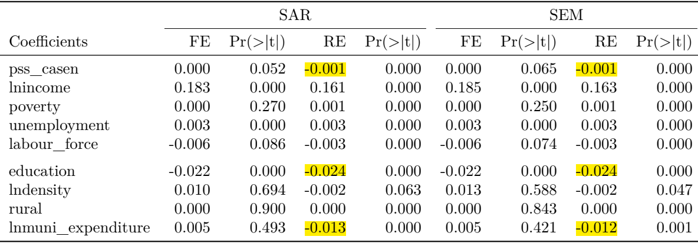

Natural Resources: Curse or Blessing? 
&emsp;&emsp;&emsp;&emsp;&emsp;&emsp;&emsp;&emsp;&emsp;&emsp;&emsp;&emsp;&emsp;
&emsp;&emsp;&emsp;&emsp;&emsp;&emsp;&emsp;&emsp;&emsp;&emsp;&emsp;&emsp;&emsp;

---
# Discussion and Recomendations

+ Contrary to our main hypothesis, NRD shows a significant and negative association with income inequality.  

--

+ This result is robust to the type of analysis (cross-sectional vs panel data), the approach (spatial vs nonspatial) and the inclusion of different controls.

--

+ Implication: The downward trend in the
participation of the primary sector in terms of employment in the Chilean economy could be one of the main reasons explaining the high persistence in the levels of income inequality.

--

+ Policies oriented to transform the structure of local economies to less dependent ones on natural resources will generate additional challenges for local and central governments in their attemps to reduce inequality  

--

+ Education and municipal expenditure seem to be effective policy tools aiming to reduce inequality in Chile.

Natural Resources: Curse or Blessing? 
&emsp;&emsp;&emsp;&emsp;&emsp;&emsp;&emsp;&emsp;&emsp;&emsp;&emsp;&emsp;&emsp;
&emsp;&emsp;&emsp;&emsp;&emsp;&emsp;&emsp;&emsp;&emsp;&emsp;&emsp;&emsp;&emsp;

 

---
# Limitations and Future Research

### Limitations
+ Data availability at the county level
+ Results do not allow us to make causal inferences about the effect of NRD on income inequality
+ Results are sensitive to the specification of the spatial weights

### Future Research
+ "Innovative" ways to define "distance" and W.
+ Incorporate measures of commuting and migration between counties.
+ Using measures of NRD as instrument for income inequality in studies about its consequences. 

Natural Resources: Curse or Blessing? 
&emsp;&emsp;&emsp;&emsp;&emsp;&emsp;&emsp;&emsp;&emsp;&emsp;&emsp;&emsp;&emsp;
&emsp;&emsp;&emsp;&emsp;&emsp;&emsp;&emsp;&emsp;&emsp;&emsp;&emsp;&emsp;&emsp;

 

---
class: inverse, center, middle

# Essay 2:

--

# Assessing and Explaining   Local Government Efficiency   in Natural Resource-Rich Countries:   The case of Chilean Municipalities

---

# Research so far

+ **Trade-off between efficiency and equity**:

--

  + Pursuing equality can reduce efficiency (see Okun 1975; Browning & Johnson 1984; Andersen & Maibom 2016)   

--

  + But, equality could also be an important ingredient in promoting and sustaining growth (see Berg & Ostry 2011; kumhof, Rancière & Winant 2015)

--

+ **Local Government Efficiency (LGE)** studies focus on:

--

.pull-left[
#### Measuring LGE
+ Provision of single services vs overall efficiency
+ Parametric (SFA) vs non-parametric (DEA) measurement techniques 
+ Input oriented vs output oriented approach and selection of inputs and outputs

]

--
.pull-right[
#### Explaining differences in LGE

+ Discretionary factors (associated with the measurement process)

+ Non-discretionary (contextual) factors including economic, financial, social, demographic, geographic, political and institutional characteristics.
]

Local Government Efficiency 
&emsp;&emsp;&emsp;&emsp;&emsp;&emsp;&emsp;&emsp;&emsp;&emsp;&emsp;&emsp;&emsp;
&emsp;&emsp;&emsp;&emsp;&emsp;&emsp;&emsp;&emsp;&emsp;&emsp;&emsp;&emsp;&emsp;

 

---
# 
 
 
 
 
 
 

.onehundredtwenty[
##Research Question
> What role does income inequality play in explaining differences in municipal efficiency? 
]

Local Government Efficiency 
&emsp;&emsp;&emsp;&emsp;&emsp;&emsp;&emsp;&emsp;&emsp;&emsp;&emsp;&emsp;&emsp;
&emsp;&emsp;&emsp;&emsp;&emsp;&emsp;&emsp;&emsp;&emsp;&emsp;&emsp;&emsp;&emsp;

 

---

# Research Hypoteses

### About the relationship between LGE and income inequality 

> $H_1$: Income inequality has a negative effect on municipal efficiency.

.right[
<i>See Tandon ,2005; Jottier, Ashworth, & Heyndels, 2012; Ortega, Sanjuán, & Casquero, 2017</i>]

**Why?; How?**

--

### About the level of inefficiency of Chilean municipalities

> $H_2$: Chilean municipalities show an average level of inefficiency of 30%.

.right[
<i>See Pacheco, Sanchez & Villena, 2013</i>
]

Local Government Efficiency 
&emsp;&emsp;&emsp;&emsp;&emsp;&emsp;&emsp;&emsp;&emsp;&emsp;&emsp;&emsp;&emsp;
&emsp;&emsp;&emsp;&emsp;&emsp;&emsp;&emsp;&emsp;&emsp;&emsp;&emsp;&emsp;&emsp;

 

???
Why (how) can inequality influence LGE?:
- General reasons argued for most of the contextual factors are:
  + It influences competition among municipalities
  + It affects degree of monitoring over local authorities
  + It affects degree of incentives to perform efficiently (Paradox of Plenty, RCH)
  + Existence of economies or diseconomies of scale in the provision of public services

- Additionally for the case of inequality:
  + It is used to capture the degree of heterogeneity in the demands that county population exerts over local authorities
  + Small richest groups can exert a higher influence over local authorities (priorities) resulting in low quality and quantity of services for most of the county population.
  + Lower inequality with high mean income should be associated with a higher monitoring and demand for an efficient performance from tax payers (not only "the richest group").
---

# Data

### First Stage (DEA): Inputs - Output used to measure LGE  

+ National System of Municipal Information, SINIM (2006-2017)
+ Sample of 324 municipalities (3888 observations)

--

### County-Level Data on Contextual Factors

--

+ National Socioeconomic Characterization Survey, CASEN (2006 - 2009 - 2011 - 2013 - 2015 - 2017)  
+ SINIM
+ "Servicio de Impuestos Internos", SII
+ National Institute of statistics, INE
+ in total 1944 observations

Local Government Efficiency 
&emsp;&emsp;&emsp;&emsp;&emsp;&emsp;&emsp;&emsp;&emsp;&emsp;&emsp;&emsp;&emsp;
&emsp;&emsp;&emsp;&emsp;&emsp;&emsp;&emsp;&emsp;&emsp;&emsp;&emsp;&emsp;&emsp;

 

---
# Methodology: Two Stage Approach

--

### First Stage: DEA analysis

--

+ Input oriented assuming variable returns to scale
+ Result: A vector of **efficiency scores (ES)** for each municipality

--

### Second Stage: Regression Analysis

--

+  **Dependent variable**: DEA efficiency scores 

--

+ **Independent variables**: 
  + Measure of Income inequality + Remaining contextual factors
  + County (zone) specific + time effects

--

+ **Estimation method**: Censored regression + Instrumental Variable (IV)

--

+ **Proposed Instrument**: 

$$pss\_firms = \frac{\text{Number of firms in primary sector}}{\text{Total number of firms}}$$

Local Government Efficiency 
&emsp;&emsp;&emsp;&emsp;&emsp;&emsp;&emsp;&emsp;&emsp;&emsp;&emsp;&emsp;&emsp;
&emsp;&emsp;&emsp;&emsp;&emsp;&emsp;&emsp;&emsp;&emsp;&emsp;&emsp;&emsp;&emsp;

 

---
class: center, middle, inverse

# First Stage: DEA Results
---
name: es-evolution
class: center

### Evolution Efficiency Scores by Zone (Full Period) 

Local Government Efficiency 
&emsp;&emsp;&emsp;&emsp;&emsp;&emsp;&emsp;&emsp;&emsp;&emsp;&emsp;&emsp;&emsp;
&emsp;&emsp;&emsp;&emsp;&emsp;&emsp;&emsp;&emsp;&emsp;&emsp;&emsp;&emsp;&emsp;

 

---
name: es
class: center

### Efficiency Scores by Zone and Region

.pull-left[

]

.pull-right[
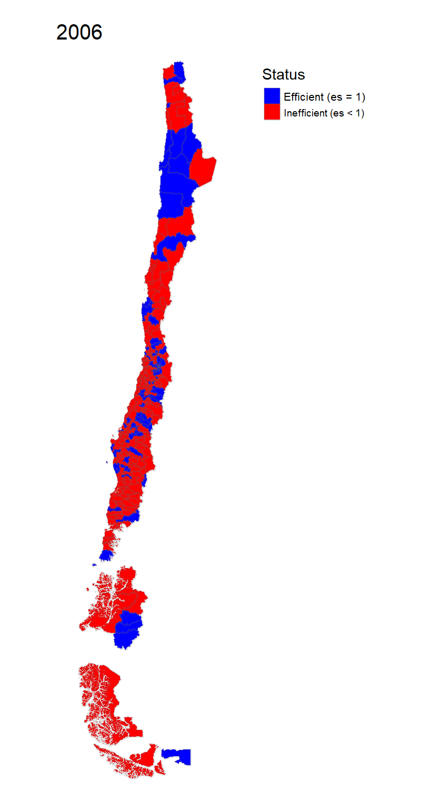
]

Local Government Efficiency 
&emsp;&emsp;&emsp;&emsp;&emsp;&emsp;&emsp;&emsp;&emsp;&emsp;&emsp;&emsp;&emsp;
&emsp;&emsp;&emsp;&emsp;&emsp;&emsp;&emsp;&emsp;&emsp;&emsp;&emsp;&emsp;&emsp;

 

---
class: center, middle, inverse

# Second Stage

---
# The model

To test our hypothesis, the empirical model is defined as:  
 

\begin{equation}
\theta_{it} = \beta_1 gini_{it}+ Z_{it}\beta + \delta_{t} + \alpha_{i}+\epsilon_{it}
\end{equation}

Where: 

- $\theta_{it}$ is the vector of efficiency scores from the DEA analysis, 

- $gini_{it}$ is the Gini coefficient of each county, 

- $Z$ is a vector of controls.

- $\delta_t$ are year-specific effects, 

- $\alpha_i$ are municipality-specific constants, 

- $\epsilon_{it}$ is a vector of error terms and 

---
class: center

### Model Comparisons - Cross-sectional Censored Regressions

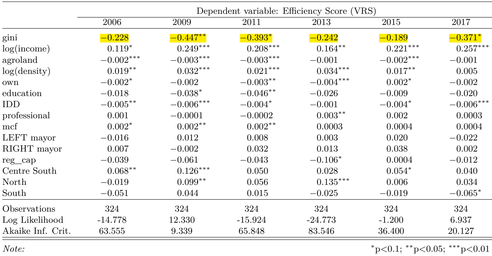

Local Government Efficiency 
&emsp;&emsp;&emsp;&emsp;&emsp;&emsp;&emsp;&emsp;&emsp;&emsp;&emsp;&emsp;&emsp;
&emsp;&emsp;&emsp;&emsp;&emsp;&emsp;&emsp;&emsp;&emsp;&emsp;&emsp;&emsp;&emsp;

 

---
background-image: url(images/tab_panel_censc.png)
background-size: contain

---
# Discussion and Recomendations

## Main results

--

+ **DEA**
  + The "production function" of municipalities shows variable returns to scale.
  + The average level of inefficiency is 17%, with higher levels in the South area of the country.
  + Efficiency shows a ciclical behaviour and, on average, has remained stable in the period 2006 - 2017.

--

+ **Regression analysis**
  + Empirical **evidence of a negative relationship between inequality and efficiency**, that is, a reduction of income inequality (or an increase in equality) could have positive effects on economic efficiency, at least at the level of local governments.

Local Government Efficiency 
&emsp;&emsp;&emsp;&emsp;&emsp;&emsp;&emsp;&emsp;&emsp;&emsp;&emsp;&emsp;&emsp;
&emsp;&emsp;&emsp;&emsp;&emsp;&emsp;&emsp;&emsp;&emsp;&emsp;&emsp;&emsp;&emsp;

 
---
# Limitations and Future Research

### Limitations

--

- Results sensitive to the selection and number of inputs and outputs

--

- Associated with observational data and the interpretation of results as causal relationships.

--

### Future research

--

- Include some output capturing the quality in the provision of public services

--

- Alternatives IV´s (?)

--

- Program evaluation in Chilean municipalities

--

- Modelling spatial dependence-heterogeneity in LGE.

--

- Given the current situation of the country: What about the issue of **reverse causality?**

Local Government Efficiency 
&emsp;&emsp;&emsp;&emsp;&emsp;&emsp;&emsp;&emsp;&emsp;&emsp;&emsp;&emsp;&emsp;
&emsp;&emsp;&emsp;&emsp;&emsp;&emsp;&emsp;&emsp;&emsp;&emsp;&emsp;&emsp;&emsp;

 

---
class: inverse, center, middle

# Essay 3:

--

# Does economic disadvantage  diminish social cohesion?  A study of the relationship between incivilities and income inequality at the municipal level in Chile

---
# What are "Incivilities"? 

--

>Incivilities are those visible disorders in the public space that violate respectful social norms and tend not to be treated as crimes by the criminal justice system

--

There two types of incivilities:
+ **Social incivilities** include antisocial behaviours such as public drinking, noisy neighbours, fighting in public places and street drug sales. 
+ **Physical incivilities** include, among others, vandalism, graffiti, abandoned cars and garbage on the streets.

--
# What is the problem?
#### Broken Window Theory

> Higher rates of incivilities are a signal of social disorganization
which result in higher crime rates (Wilson & Kelling, 1982)

Does economic disadvantage diminish social cohesion? 
&emsp;&emsp;&emsp;&emsp;&emsp;&emsp;&emsp;&emsp;&emsp;&emsp;&emsp;&emsp;&emsp;
&emsp;&emsp;&emsp;&emsp;&emsp;&emsp;&emsp;&emsp;&emsp;&emsp;&emsp;&emsp;&emsp;

 
---
# Research so far

>The negative impact of incivilities is not merely reflected in its **association with crime rates** (Skogan, 2015)

--

Incivilities have been associated with:
+ **Health problems** (Branas et al., 2011; Cohenet al., 2000; Hill & Angel, 2005; Ross, 2011; Ross & Mirowsky, 2001)

--

+ **Greater victimization** and **fear of crime** (Brunton-Smith, Jackson, & Sutherland, 2014; Mijanovich & Weitzman, 2003)

--

+ Multiple negative **economic effects**:
  + Reduction in commercial activity, lower investment in real state and reduction in house prices (Skogan, 2015)
  + Population instability (Hipp, 2010).

Does economic disadvantage diminish social cohesion? 
&emsp;&emsp;&emsp;&emsp;&emsp;&emsp;&emsp;&emsp;&emsp;&emsp;&emsp;&emsp;&emsp;
&emsp;&emsp;&emsp;&emsp;&emsp;&emsp;&emsp;&emsp;&emsp;&emsp;&emsp;&emsp;&emsp;

 
---
# Research so far

--

#### The "Incivilities Thesis"

>Incivilities are caused by inequality and the lack of informal mechanisms of social control. The patterns of incivilities should mirror the patterns of inequality (Taylor, 1999)

--

#### Chilean evidence: 
+ Focussed on crime and showing weak and ambiguous results
  + **Indicators of socio-economic disadvantage** would only have significant effects on property crime (Beyer & Vergara, 2006; Nuñez, Rivera, Villavicencio, & Molina, 2003; Rivera, Gutiérrez, & Núñez,2009). 
  + **Crime deterrence variables**: The probability of being caught or the number of police resources (Beyer & Vergara, 2006; Rivera et al., 2009; Vergara, 2012).

Does economic disadvantage diminish social cohesion? 
&emsp;&emsp;&emsp;&emsp;&emsp;&emsp;&emsp;&emsp;&emsp;&emsp;&emsp;&emsp;&emsp;
&emsp;&emsp;&emsp;&emsp;&emsp;&emsp;&emsp;&emsp;&emsp;&emsp;&emsp;&emsp;&emsp;

 

???
In Chile there is no evidence about causes of incivilities, but the BRoken Windows Theory has been used to argue new punitive actions to reduce crime, victimization and the feeling of insecutity in the population 
---
class: center, middle, inverse

# Research Question

--

# Do differences in the rate of incivilities mirror differences in income inequality between counties? 

Does economic disadvantage diminish social cohesion?
&emsp;&emsp;&emsp;&emsp;&emsp;&emsp;&emsp;&emsp;&emsp;&emsp;&emsp;&emsp;&emsp;
&emsp;&emsp;&emsp;&emsp;&emsp;&emsp;&emsp;&emsp;&emsp;&emsp;&emsp;&emsp;&emsp;

 

---

# Research Hypoteses

> $H_1$: Incivilities will be higher in counties with high levels of inequality.  

&NewLine;

--

> $H_2$: Incivilities will be higher in counties with a high proportion of the young population.

&NewLine;
--

> $H_3$: Incivilities will be higher in counties with a high proportion of foreign inhabitants.

&NewLine;
--

> $H_4$: Incivilities will be lower in counties managed by municipalities more autonomous from central government transfers.

Does economic disadvantage diminish social cohesion?
&emsp;&emsp;&emsp;&emsp;&emsp;&emsp;&emsp;&emsp;&emsp;&emsp;&emsp;&emsp;&emsp;
&emsp;&emsp;&emsp;&emsp;&emsp;&emsp;&emsp;&emsp;&emsp;&emsp;&emsp;&emsp;&emsp;

 

???
In general, the relationship (effect) with incivilities depend on whether the variable is associated with a higher (lower) reported rate and/or whether it associated with a higher "probability to commit negligent or antisocial behaviour" (reduction in informal control) 
---

# Data

+ Data on the number of **incivilities** were obtained from the **“Centre of Studies and Analysis of Crime”** (Chilean government) 

+ Dependent variable:

\begin{equation}
inciv\_rate=\frac{incivilities_{it}}{n_{it}}*1000;
\end{equation}

  + Where $inciv\_rate$ is the incivilities rate, $t$ is the year, $i$ the county and $n$ is the population of the county per year.

+ Independent variable:
  + The **Gini coefficient** is calculated for each county
and included through the variable _gini_.

Does economic disadvantage diminish social cohesion? 
&emsp;&emsp;&emsp;&emsp;&emsp;&emsp;&emsp;&emsp;&emsp;&emsp;&emsp;&emsp;&emsp;
&emsp;&emsp;&emsp;&emsp;&emsp;&emsp;&emsp;&emsp;&emsp;&emsp;&emsp;&emsp;&emsp;

 

---
class: center
## Evolution Average County Rate of Incivilities  per 1000 inhabitants

---
class: center
## Evolution Total Number of Incivilities by Category

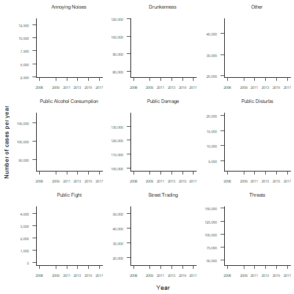

Does economic disadvantage diminish social cohesion? 
&emsp;&emsp;&emsp;&emsp;&emsp;&emsp;&emsp;&emsp;&emsp;&emsp;&emsp;&emsp;&emsp;
&emsp;&emsp;&emsp;&emsp;&emsp;&emsp;&emsp;&emsp;&emsp;&emsp;&emsp;&emsp;&emsp;

 

---
class: center
## Annual Average Number of Incivilities per County

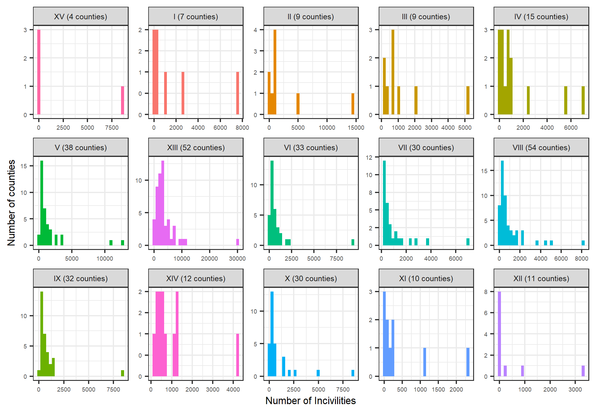

Does economic disadvantage diminish social cohesion? 
&emsp;&emsp;&emsp;&emsp;&emsp;&emsp;&emsp;&emsp;&emsp;&emsp;&emsp;&emsp;&emsp;
&emsp;&emsp;&emsp;&emsp;&emsp;&emsp;&emsp;&emsp;&emsp;&emsp;&emsp;&emsp;&emsp;

 

---

# Method: Panel Count Data models

+ Considering as the response variable the count of incivilities:

\begin{equation}
\lambda_{it} =exp(\beta_0 + \beta_1gini_{it} + X\gamma+\alpha_i +\theta_t)
\end{equation}

--

+ where
  + $\lambda$ is the rate of incivilities, 
  + $X$ is our vector of controls, 
  + $\alpha's$ are county-specific constants and 
  + $\theta's$ are time-specific constants. 

--

+ To account for differences in county population, we have:

\begin{equation}
\frac{\lambda_{it}}{(\frac{population_{it}}{1000})} =exp(\beta_0 + \beta_1gini_{it} + X\gamma+\alpha_i +\theta_t)
\end{equation}

+ The model estimated using Maximum Likelihood Estimation (MLE) is:

\begin{equation}
log(\lambda_{it}) = \beta_0 + \beta_1gini_{it} + X\gamma+\alpha_i +\theta_t+log(\frac{population_{it}}{1000})
\end{equation}

Does economic disadvantage diminish social cohesion?
&emsp;&emsp;&emsp;&emsp;&emsp;&emsp;&emsp;&emsp;&emsp;&emsp;&emsp;&emsp;&emsp;
&emsp;&emsp;&emsp;&emsp;&emsp;&emsp;&emsp;&emsp;&emsp;&emsp;&emsp;&emsp;&emsp;

 

---
class: center
#### Results: Poisson Regression

Does economic disadvantage diminish social cohesion?
&emsp;&emsp;&emsp;&emsp;&emsp;&emsp;&emsp;&emsp;&emsp;&emsp;&emsp;&emsp;&emsp;
&emsp;&emsp;&emsp;&emsp;&emsp;&emsp;&emsp;&emsp;&emsp;&emsp;&emsp;&emsp;&emsp;

 

---
class: center
#### Results: Negative Binomial

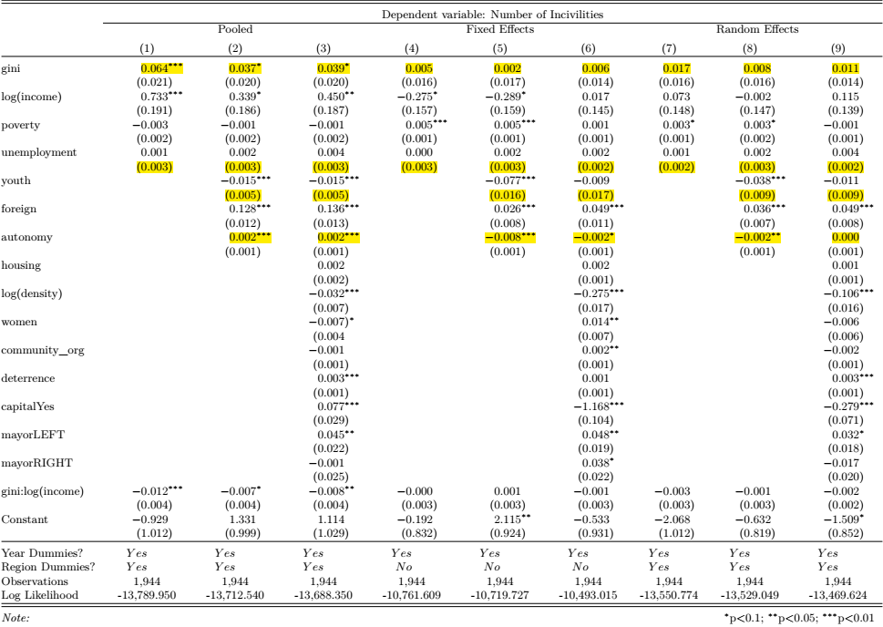

Does economic disadvantage diminish social cohesion?
&emsp;&emsp;&emsp;&emsp;&emsp;&emsp;&emsp;&emsp;&emsp;&emsp;&emsp;&emsp;&emsp;
&emsp;&emsp;&emsp;&emsp;&emsp;&emsp;&emsp;&emsp;&emsp;&emsp;&emsp;&emsp;&emsp;

 

---
# Discussion and Recomendations

+ We found strong evidence of a **significant and positive association between the rate of incivilities and income inequality**. 

--

+ Policies aimed at controlling the behaviour of **young people** do not have strong empirical support. 

+ The significant increase in the **foreign population** seems to be associated with a significant increase in the problem of incivilities. 

--

+ Efforts managed from the municipalities can be an important complement to those from the central government.

--

+ Mayors supported by “LEFT” oriented political parties face higher challenges in terms of incivilities than those independent or RIGHT supported mayors.

Does economic disadvantage diminish social cohesion? 
&emsp;&emsp;&emsp;&emsp;&emsp;&emsp;&emsp;&emsp;&emsp;&emsp;&emsp;&emsp;&emsp;
&emsp;&emsp;&emsp;&emsp;&emsp;&emsp;&emsp;&emsp;&emsp;&emsp;&emsp;&emsp;&emsp;

 

???
The political result is the only one significant among the thesis studies
---
# Conclusions and Future Research

+ Increasing income inequality or persistently high levels might be associated with the rise of antisocial behaviours in the form of incivilities. 

--

+ Future research should go further on the role of local authorities analysing the impact of specific programs in counties with similar characteristics.

--

+ Program evaluation could help to elucidate the question of whether local interventions from the local governments have a causal effect on incivilities and crime rates. 

--

+ A deeper analysis of the impact that foreign migration is having on social cohesion in the Chilean society is an interesting avenue for future studies

Does economic disadvantage diminish social cohesion?
&emsp;&emsp;&emsp;&emsp;&emsp;&emsp;&emsp;&emsp;&emsp;&emsp;&emsp;&emsp;&emsp;
&emsp;&emsp;&emsp;&emsp;&emsp;&emsp;&emsp;&emsp;&emsp;&emsp;&emsp;&emsp;&emsp;

 
---

background-image: url(images/paz.jpg)
background-size: cover

class: inverse, center, middle

--

# Thanks 

--

# Thanks for Listening!

--

# Questions?

